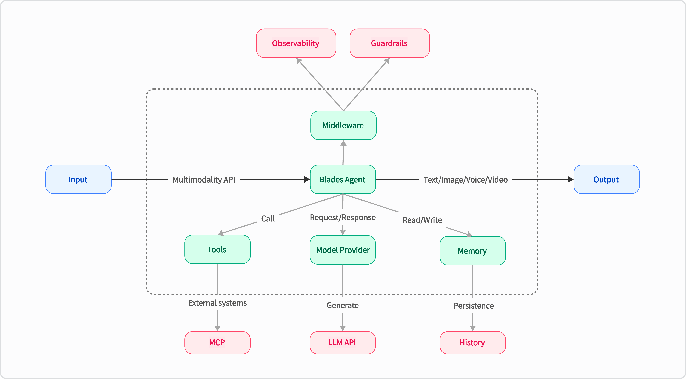
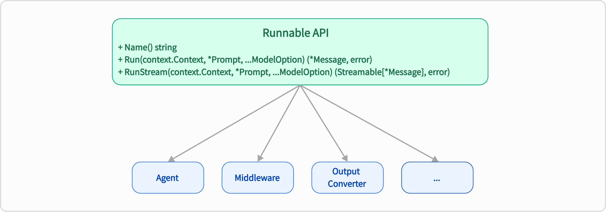
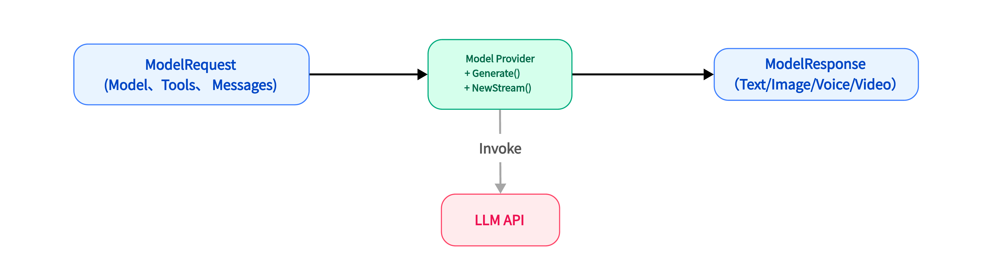

## Blades
Blades is a multimodal AI Agent framework in Go, supporting custom models, tools, memory, middleware, and more. It is well-suited for multi-turn conversations, chain reasoning, and structured output.
> The name comes from the game God of War, set in Greek mythology, which tells the story of Kratos, who becomes a god of war and embarks on a divine slaughter. Blades are Kratos's iconic weapons.

## Architecture Design
Blades leverages the characteristics of Go to provide a flexible and efficient AI Agent solution. Its core lies in achieving high decoupling and extensibility through a unified interface and pluggable components. The overall architecture is as follows:


- **Go Idiomatic**: Built entirely in the Go way, the code style and user experience make Go developers feel at home.
- **Easy to Use**: Through concise code, define an AI Agent and quickly deliver requirements, making complex logic clear, easy to manage, and maintain.
- **Middleware Ecosystem**: Drawing inspiration from Kratos’s middleware design philosophy, features like Observability, Guardrails, and others can be easily integrated into the AI Agent.
- **Highly Extensible**: Through a unified interface and pluggable components, achieve high decoupling and extensibility, making it easy to integrate different LLM models and external tools.

## Core Concepts
The Blades framework achieves its powerful functionality and flexibility through a series of well-designed core components. These components work together to build the intelligent behavior of the Agent:

* **Agent (Intelligent Entity)**: The core unit that executes tasks, capable of invoking models and tools.
* **Prompt (Prompt Text)**: A templated text used to interact with LLMs, supporting dynamic variable substitution and complex context construction.
* **Chain (Chain)**: Links multiple Agents or other Chains to form complex workflows.
* **ModelProvider (Model)**: A pluggable LLM interface, allowing you to easily switch and integrate different language model services (such as OpenAI).
* **Tool (Tool)**: External capabilities that the Agent can use, such as calling APIs, querying databases, accessing file systems, etc.
* **Memory (Memory)**: Provides short-term or long-term memory capabilities for the Agent, enabling context-aware continuous conversations.
* **Middleware (Middleware)**: Similar to middleware in web frameworks, it can implement cross-cutting control over the Agent.

### Runnable
`Runnable` is the most core interface in the Blades framework, defining the basic behavior of all executable components. Its design aims to provide a unified execution paradigm, achieving **decoupling, standardization, and high composability** of various functional modules within the framework through the `Run` and `RunStream` methods. Components such as `Agent`, `Chain`, and `ModelProvider` all implement this interface, unifying their execution logic and allowing different components to be flexibly combined like LEGO bricks to build complex AI Agents.

```go
// Runnable represents an entity that can process prompts and generate responses.
type Runnable interface {
    Run(context.Context, *Prompt, ...ModelOption) (*Message, error)
    RunStream(context.Context, *Prompt, ...ModelOption) (Streamable[*Message], error)
}
```


### ModelProvider
`ModelProvider` is the core abstraction layer in the `Blades` framework for interacting with underlying large language models (LLMs). Its design goal is to achieve **decoupling and extensibility** through a unified interface, separating the framework's core logic from the implementation details of specific models (such as OpenAI, DeepSeek, Gemini, etc.). It acts as an adapter, responsible for converting standardized requests within the framework into the format required by the native API of the model and converting the model's response back into the framework's standard format, thus allowing developers to easily switch and integrate different LLMs.

```go
type ModelProvider interface {
    // Generate performs a complete generation request and returns the result at once. Suitable for scenarios where real-time feedback is not needed.
    Generate(context.Context, *ModelRequest, ...ModelOption) (*ModelResponse, error)
    // NewStream initiates a streaming request. This method immediately returns a Streamable object, through which the caller can receive the generated content from the model step by step, suitable for building real-time, typewriter-effect conversation applications.
    NewStream(context.Context, *ModelRequest, ...ModelOption) (Streamable[*ModelResponse], error)
}
```


### Agent
`Agent` is the core orchestrator in the `Blades` framework. As the highest-level `Runnable`, it integrates and orchestrates `ModelProvider`, `Tool`, `Memory`, and `Middleware` components to understand user intent and execute complex tasks. Its design allows for flexible configuration through `Option` functions, driving the behavior and capabilities of intelligent applications, and fulfilling core responsibilities such as task orchestration, context management, and instruction following.

### Flow
The `flow` is designed to construct complex workflows and multi-step reasoning. Its core concept is to orchestrate multiple `Runnable` components, enabling the transfer of data and control flow, where the output of one `Runnable` can serve as the input for the next. This mechanism allows developers to flexibly combine components, build highly customized AI workflows, and achieve multi-step reasoning and complex data processing, making it a key enabler for implementing Agent-based decision-making processes.

### Tool
`Tool` is a key component for extending the capabilities of an AI Agent, representing external functions or services that the Agent can call. Its design aims to empower the Agent with the ability to interact with the real world, perform specific actions, or obtain external information. Through a clear `InputSchema`, it guides the LLM to generate the correct call parameters and executes the actual logic through an internal `Handle` function, thereby encapsulating various external APIs, database queries, etc., into a form that the Agent can understand and invoke.

### Memory
The `Memory` component endows the AI Agent with memory capabilities, providing a general interface for storing and retrieving conversation messages, ensuring that the Agent maintains context and coherence in multi-turn conversations. Its design supports managing messages by session ID and can be configured with message quantity limits to balance the breadth of memory and system resource consumption. The framework provides an `InMemory` implementation and also encourages developers to extend to persistent storage or more complex memory strategies.

```go
type Memory interface {
	AddMemory(context.Context, *Memory) error
	SaveSession(context.Context, blades.Session) error
	SearchMemory(context.Context, string) ([]*Memory, error)
}
```

### Middleware
`Middleware` is a powerful mechanism for implementing cross-cutting concerns such as logging, monitoring, authentication, and rate limiting. Its design allows for injecting additional behaviors into the `Runnable` execution flow without modifying the core `Runnable` logic. It works in an "onion model" function chain, providing highly flexible flow control and functional enhancements, thus decoupling non-core business logic from core functionality.

## 💡 Quick Start

### Usage Example (Chat Agent)

Below is a simple chat Agent example, demonstrating how to use the OpenAI `ModelProvider` to build a basic conversation application:

```go
package main

import (
	"context"
	"log"

	"github.com/go-kratos/blades"
	"github.com/go-kratos/blades/contrib/openai"
)

func main() {
	agent := blades.NewAgent(
		"Template Agent",
		blades.WithModel("gpt-5"),
		blades.WithProvider(openai.NewChatProvider()),
	)

	// Define templates and params
	params := map[string]any{
		"topic":    "The Future of Artificial Intelligence",
		"audience": "General reader",
	}

	// Build prompt using the template builder
	// Note: Use exported methods when calling from another package.
	prompt, err := blades.NewPromptTemplate().
		System("Please summarize {{.topic}} in three key points.", params).
		User("Respond concisely and accurately for a {{.audience}} audience.", params).
		Build()
	if err != nil {
		log.Fatal(err)
	}

	log.Println("Generated Prompt:", prompt.String())

	// Run the agent with the templated prompt
	result, err := agent.Run(context.Background(), prompt)
	if err != nil {
		log.Fatal(err)
	}
	log.Println(result.Text())
}

```
For more examples, see the [examples](./examples) directory.

## 🤝 Contribution and Community
The project is currently in its early stages, and we are continuously iterating rapidly. We sincerely invite all Go developers and AI enthusiasts to visit our GitHub repository and personally experience the joy of development with Blades.

Feel free to give the project a ⭐️ Star, explore more usage in the `examples` directory, or get started building your first Go LLM application!

We look forward to any feedback, suggestions, and contributions to jointly promote the prosperity of the Go AI ecosystem.

## 📄 License

Blades is licensed under the MIT License. For more details, please refer to the [LICENSE](LICENSE) file.
