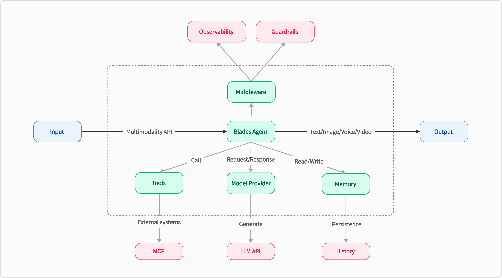

## Blades
Blades 是一个 Go 语言的多模态 AI Agent 框架，支持自定义模型、工具、记忆体、中间件等，适用于多轮对话、链式推理和结构化输出等。
> 名字来源于：《战神》游戏以希腊神话为背景，讲述奎托斯（Kratos）由凡人成为战神并展开弑神屠杀的冒险经历，Blades 是奎托斯的标志性武器。

## 架构设计
Blades 结合 Go 语言的特性，提供了灵活且高效的 AI Agent 解决方案。其核心在于通过统一的接口和可插拔的组件，实现高度的解耦和可扩展性。整体架构如下：


- Go Idiomatic：完全依照 Go 的思维方式构建，代码风格、使用体验都让 Go 开发者感到亲切。
- 使用简单：通过简洁的代码生命，定义 AI Agent，实现需求快速交付，让复杂的逻辑变得清晰、易于管理和维护。
- 中间件生态：借鉴 Kratos 的中间件设计理念，无论是 Observability、Guardrails，都可以方便的集成到 AI Agent。
- 高度可扩展：通过统一的接口和可插拔的组件，实现高度的解耦和可扩展性，方便集成不同的 LLM 模型和外部工具。

## 核心概念
Blades 框架通过一系列精心设计的核心组件，实现了其强大的功能和灵活性。这些组件协同工作，共同构建了 Agent 的智能行为：

* Agent (智能体)：执行任务的核心单元，可以调用模型和工具。
* Prompt (提示词)：用于与 LLM 交互的模板化文本，支持动态变量替换和复杂的上下文构建。
* Chain (链)：将多个 Agent 或其他 Chain 串联起来，形成复杂的工作流。
* ModelProvider (模型)：可插拔的 LLM 接口，您可以轻松切换和集成不同的语言模型服务（如 OpenAI 等）。
* Tool (工具)：Agent 可以使用的外部能力，例如调用 API、查询数据库、访问文件系统等。
* Memory (记忆)：为 Agent 提供短期或长期的记忆能力，实现具备上下文的连续对话。
* Middleware (中间件)：类似于 Web 框架中的中间件，可以实现对 Agent 的横切面控制。

### Runnable
`Runnable` 是 Blades 框架中最核心的接口，它定义了所有可执行组件的基本行为。其设计旨在提供一个统一的执行范式，通过 `Run` 和 `RunStream` 方法，实现了框架内各种功能模块的**解耦、标准化和高度可组合性**。`Agent`、`Chain`、`ModelProvider` 等组件都实现了此接口，从而统一了它们的执行逻辑，使得不同组件能够像乐高积木一样灵活组合，构建复杂的 AI Agent。

```go
// Runnable represents an entity that can process prompts and generate responses.
type Runnable interface {
    Name() string
    Run(context.Context, *Prompt, ...ModelOption) (*Message, error)
    RunStream(context.Context, *Prompt, ...ModelOption) (Streamable[*Message], error)
}
```


### ModelProvider
`ModelProvider` 是 `Blades` 框架与底层大语言模型（LLM）进行交互的核心抽象层。其设计目标在于通过统一的接口实现**解耦和扩展性**，使得框架核心逻辑与特定模型（如 OpenAI, DeepSeek, Gemini 等）的实现细节分离。它扮演着适配器角色，负责将框架内部的标准化请求转换为模型原生 API 所需的格式，并将模型响应转换回框架标准格式，从而支持开发者轻松切换和集成不同的 LLM。

```go
type ModelProvider interface {
    // Generate 执行一个完整的生成请求，并一次性返回结果。适用于不需要实时反馈的场景。
    Generate(context.Context, *ModelRequest, ...ModelOption) (*ModelResponse, error)
    // NewStream 发起一个流式请求。该方法会立即返回一个 Streamable 对象，调用者可以通过这个对象逐步接收模型生成的内容，适用于构建实时的、打字机效果的对话应用。
    NewStream(context.Context, *ModelRequest, ...ModelOption) (Streamable[*ModelResponse], error)
}
```


### Agent
`Agent` 是 `Blades` 框架中的核心协调者，作为最高层的 `Runnable`，它整合并编排 `ModelProvider`、`Tool`、`Memory` 和 `Middleware` 等组件，以理解用户意图并执行复杂的任务。其设计允许通过灵活的 `Option` 函数进行配置，从而驱动智能应用的行为和能力，实现任务编排、上下文管理和指令遵循等核心职责。

### Flow
`flow` 用于构建复杂的工作流和多步推理。其设计理念是将多个 `Runnable` 做编排，实现数据和控制流的传递，其中一个 `Runnable` 的输出可以作为下一个 `Runnable` 的输入。该机制使得开发者能够灵活地组合组件，构建高度定制化的 AI 工作流，实现多步推理和复杂数据处理，是实现 Agent 复杂决策流程的关键。

### Tool
`Tool` 是扩展 AI Agent 能力的关键组件，代表 Agent 可调用的外部功能或服务。其设计旨在赋予 Agent 与真实世界交互的能力，执行特定动作或获取外部信息。通过清晰的 `InputSchema`，它指导 LLM 生成正确的调用参数，并通过内部的 `Handle` 函数执行实际逻辑，从而将各种外部 API、数据库查询等封装成 Agent 可理解和可调用的形式。

### Memory
`Memory` 组件赋予 AI Agent 记忆能力，提供通用接口存储和检索对话消息，确保 Agent 在多轮对话中保持上下文和连贯性。其设计支持按会话 ID 管理消息，并可配置消息数量限制，以平衡记忆的广度与系统资源的消耗。框架提供 `InMemory` 实现，同时也鼓励开发者扩展至持久化存储或更复杂的记忆策略。

```go
type Memory interface {
AddMessages(context.Context, string, []*Message) error
ListMessages(context.Context, string) ([]*Message, error)
Clear(context.Context, string) error
}
```

### Middleware
`Middleware` 是实现横切关注点（如日志、监控、认证、限流）的强大机制。其设计允许在 `Runner` 的执行流程中注入额外行为，而无需修改 `Runner` 核心逻辑。它以“洋葱模型”的函数链形式工作，提供高度灵活的流程控制和功能增强，从而实现非核心业务逻辑与核心功能的解耦。

## 💡 快速开始

### 使用示例 (聊天 Agent)

以下是一个简单的聊天 Agent 示例，展示了如何使用 OpenAI `ModelProvider` 构建一个基本的对话应用：

```go
package main

import (
    "context"
    "log"

    "github.com/go-kratos/blades"
    "github.com/go-kratos/blades/contrib/openai"
)

func main() {
    agent := blades.NewAgent(
        "Template Agent",
        blades.WithModel("gpt-5"),
        blades.WithProvider(openai.NewChatProvider()),
    )

    // Define templates and params
    params := map[string]any{
        "topic":    "The Future of Artificial Intelligence",
        "audience": "General reader",
    }

    // Build prompt using the template builder
    // Note: Use exported methods when calling from another package.
    prompt, err := blades.NewPromptTemplate().
        System("Please summarize {{.topic}} in three key points.", params).
        User("Respond concisely and accurately for a {{.audience}} audience.", params).
        Build()
    if err != nil {
        log.Fatal(err)
    }

    log.Println("Generated Prompt:", prompt.String())

    // Run the agent with the templated prompt
    result, err := agent.Run(context.Background(), prompt)
    if err != nil {
        log.Fatal(err)
    }
    log.Println(result.Text())
}

```
更多示例请参见 [examples](./examples) 目录。

## 🤝 贡献与社区
项目当前处于初期阶段，我们正在持续快速地迭代中。我们诚挚地邀请所有 Go 开发者和 AI 爱好者访问我们的 GitHub 仓库，亲自体验 Blades 带来的开发乐趣。

欢迎为项目点亮一个 ⭐️ Star，探索 `examples` 目录下的更多用法，或者直接上手构建您的第一个 Go LLM 应用！

我们期待您的任何反馈、建议和贡献，共同促进 Go AI 生态的繁荣。


## 📄 许可证

Blades 采用 MIT 许可证。详情请参阅 [LICENSE](LICENSE) 文件。
